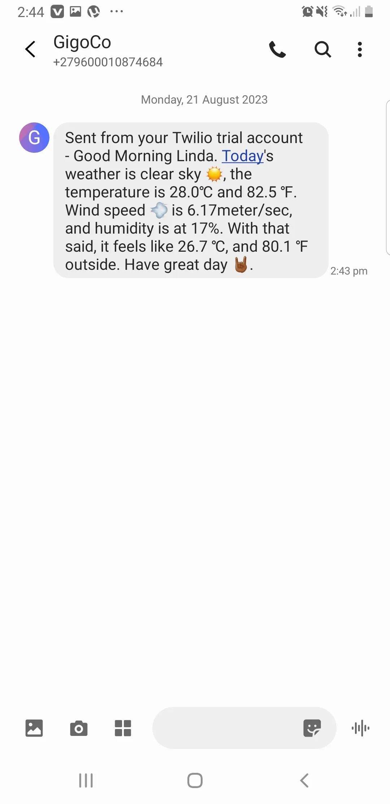
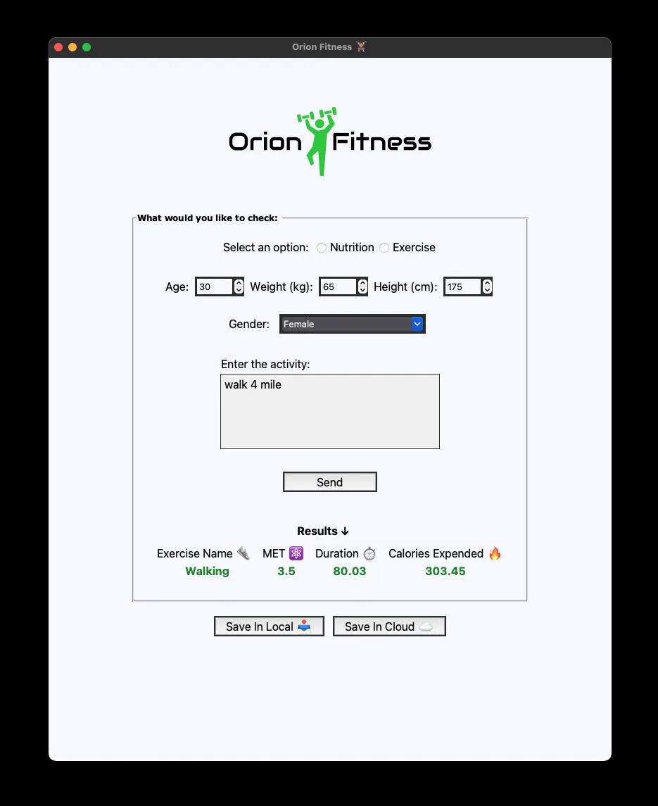

# KoiGenix Web-Lab.co 

      

The saying  ***practice makes perfect*** is forever true. One cannot be a professional in his field without wealth of experience. In the field of technology - Software Engineering or Software Development, it takes a lot of mistakes by practicing and building projects to be great at this field. This is why the repository is created. It holds all the projects that I will build myself. Not projects from Udemy courses or School projects. Building these projects would solidfy my knowledge and understanding on the different technologies/programming languages.

> [!NOTE]  
> To make this repository interesting and fun for me, I will play pretend that I am working for a company  
> (KoiGenix Web-Lab.co) and we build various Software and Web Applications for our different clients. 😉
___

|      Cleints 👫       |  Difficulty Level 📊   |  Progress 📈   | Responsive 📱 | Timeframe ⏱️ |
|:---------------------:|:----------------------:|:--------------:|:-------------:|:------------:|
|        1Corner        |  Intermediate 🏋🏽‍♂️  |  ✅ Completed   |       ✅       | 1 1/2 weeks  
|  Lynwood University   |       Advance 🤼       | 🌀 In-progress |       ✅       |  Pending..   |
|        GigiCo         |  Intermediate 🏋🏽‍♂️  |  ✅ Completed   |      ‼️       |   24 hours   |
|     Orion Limited     | Intermediate  🏋🏽‍♂️  |  ✅ Completed   |      ‼️       |    2 days    |
|  |  |           |          |     |

___

##      [1Corner Restaurant](https://koigor97.github.io/projects/oneCorner)

The owner of 1Corner (pronounced One-Corner) restaurant, Ms. Rachel Jones contacted my company to build a landing page for her restaurant. As the Senior Developer, I was handed the project. The tech stack needed was Html, Sass, and little bit of JavaScript. The client and I discussed on the design from the UI and UX team, with the assests (images, context and content) she provided. She was pleased with the design and gave the go ahead to proceed with the development.

___

## GigCo—Weather 🌦️ update
GigCo is a company that deals with validating and issuing out coupons and coupon codes for various
companies and vendors in South Africa.
Productivity was on a decline because employees were getting to work late or really wet by the weather
conditions, hence, the work environment was dull.
70% of the employees don't have access to weather update/forecast, so the manager reached out to our company
to provide a solution where each employee, every morning, gets a weather update notification
through SMS.
This will make better prepare themselves before leaving their homes.
I code up the solution using the OpenWeather API (free version), with the Twilio API for sending
the messages.
The application runs in the cloud (PythonAnywhere cloud services).

___

## Orion Health Tracker 💪🏽
Orion Limited contacted us to build a Health tracker application for their employees.
It's part of the company's campaign to make provide it employees a way for them to take account of what they are eating
and to track their workouts.
We built the application using a third party services—"Nutritionix API".
Using their natural language module API in the area of Nutrient and Exercise,
we were able to achieve their (Orion) goal.
The application provides the employee a way to save their data in Google Sheet or locally in their computer
as CSV file.

>[!WARNING]  
> The Nutrient API doesn't work just yet because the free API id and key is not authorise
> to use the nutrient api.
> However, you can the exercise api is fully functional.
> So you might only get results for workouts.  
> Also, the Google sheet server is down.
> "Server 500 Error ⚠️".
> So you can only save locally.

___

