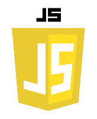
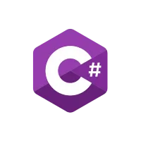

# KoiGenix Web-Lab.co

       

The saying **_practice makes perfect_** is forever true. One cannot be a professional in his field without wealth of experience. In the field of technology - Software Engineering or Software Development, it takes a lot of mistakes by practicing and building projects to be great at this field. This is why this repository is created. It holds all the projects that I will build myself. Not projects from Udemy courses or School projects. Building these projects would solidfy my knowledge and understanding on the different technologies/programming languages.

> [!NOTE]  
> To make this repository interesting and fun for me, I play pretend that I work for a company  
> (KoiGenix Web-Lab.co) and we build various Software and Web Applications for our clients. 😉

---

|   Cleints 👫    | Difficulty Level 📊 |  Progress 📈  | Responsive 📱 | Timeframe ⏱️ |
| :-------------: | :-----------------: | :-----------: | :-----------: | :----------: |
|     1Corner     |   Intermediate 🏋🏽‍♂️   | ✅ Completed  |      ✅       | 1 1/2 weeks  |
| Lynwood Chamber |   Intermediate 🏋🏽‍♂️   | ✅ Completed  |      ✅       |   semester   |
|     GigiCo      |   Intermediate 🏋🏽‍♂️   | ✅ Completed  |      ‼️       |   24 hours   |
|  Orion Limited  |   Intermediate 🏋🏽‍♂️   | ✅ Completed  |    TkInter    |    2 days    |
|    Due Date     |     Advance 🤼      | 🌀 Pending... |      📵       |    ......    |
|  PartyHouseHub  |       Advance       | 🌀 Pending... |      ✅       |   .......    |
|   OutSmart-Me   |   Intermediate 🏋🏽‍♂️   | ✅ Completed  |      📵       |    2 days    |

---
