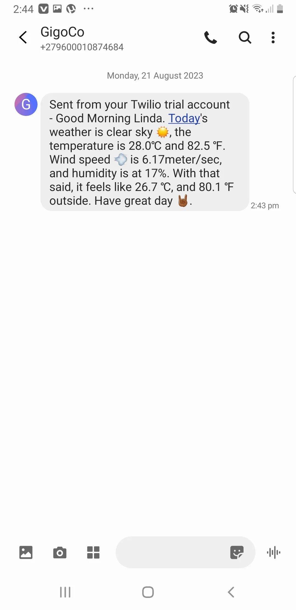

# GigCo—Weather 🌦️ update

GigCo is a company that deals with validating and issuing out coupons and coupon codes for various
companies and vendors in South Africa.
Productivity was on a decline because employees were getting to work late or really wet by the weather
conditions, hence, the work environment was dull.
70% of the employees don't have access to weather update/forecast, so the manager reached out to our company
to provide a solution where each employee, every morning, gets a weather update notification
through SMS.
This will make better prepare themselves before leaving their homes.
I code up the solution using the OpenWeather API (free version), with the Twilio API for sending
the messages.
The application runs in the cloud (PythonAnywhere cloud services).

---

