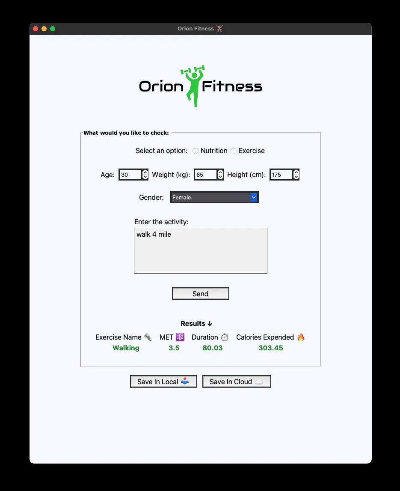

# Orion Health Tracker 💪🏽

Orion Limited contacted us to build a Health tracker application for their employees.
It's part of the company's campaign to make provide it employees a way for them to take account of what they are eating
and to track their workouts.
We built the application using a third party services—"Nutritionix API".
Using their natural language module API in the area of Nutrient and Exercise,
we were able to achieve their (Orion) goal.
The application provides the employee a way to save their data in Google Sheet or locally in their computer
as CSV file.

> [!WARNING]  
> The Nutrient API doesn't work just yet because the free API id and key is not authorise
> to use the nutrient api.
> However, you can the exercise api is fully functional.
> So you might only get results for workouts.  
> Also, the Google sheet server is down.
> "Server 500 Error ⚠️".
> So you can only save locally.

