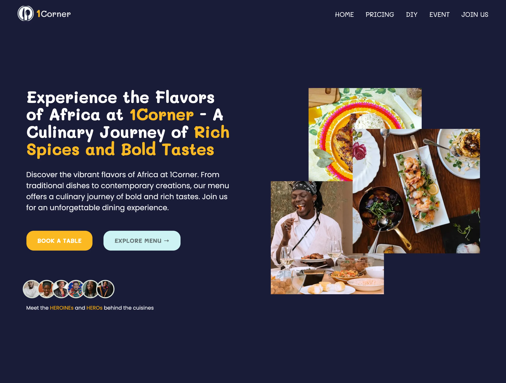

#  [1Corner Restaurant](https://koigor97.github.io/projects/oneCorner)

The owner of 1Corner (pronounced One-Corner) restaurant, Ms. Rachel Jones contacted my company to build a landing page for her restaurant. As the Senior Developer, I was handed the project. The tech stack needed was Html, Sass, and little bit of JavaScript. The client and I discussed on the design from the UI and UX team, with the assests (images, context and content) she provided. She was pleased with the design and gave the go ahead to proceed with the development.

---

